# ShipGate

> **ShipGate is a merchant-configurable decision-policy layer for COD RTO risk. It converts risk signals — whether from transparent local rules or an upstream risk provider — into the least-disruptive action that is economically justified, with every score, rule, threshold, override, and final delivery outcome recorded in an audit trail.**

Risk detection tells a merchant an order may fail. ShipGate decides what to do next — ship, verify, nudge toward prepaid, or review — while making the cost and reasoning visible.

Built for the Razorpay AI Buildathon 2026, Track 02 (AI Risk Manager).

> ⚠️ **All evaluation data in this prototype is synthetic.** Every number below is a **synthetic simulation result — it validates policy logic, not production accuracy.**

---

## The Problem

Cash-on-delivery orders in India fail to deliver 20–40% of the time. The parcel goes out, the customer refuses it or nobody can find the address, and it comes back — RTO, Return to Origin. The seller pays freight both ways plus handling and sells nothing.

This is a real and expensive problem, and it is already well served on the *detection* side. Razorpay's COD Intelligence inside Magic Checkout does order-level, reason-based risk scoring, and already offers confirmation, address-correction and prepaid-incentive flows for medium-risk orders. Delhivery and Cashfree sell comparable tools.

ShipGate does not compete with that detection. It complements it, and it addresses a different question: **given a risk signal, what should actually happen to this order, and can the merchant defend that decision afterwards?**

The gap it fills is the one between a score and an action:

- a score alone does not tell you whether intervening is *worth it* for a given order;
- a merchant who wants to be gentler or stricter needs to change policy without touching scoring logic;
- and when a customer complains, or a reviewer asks, somebody has to be able to say exactly why an order was treated the way it was.

---

## How It Works

```
Checkout / order payload
        ↓
Feature normalizer          only history that had already resolved
        ↓
Rule engine                 grouped, capped, explainable score
        ↓
Risk score + fired-rule trace
        ↓
Policy engine               merchant config picks the least-disruptive action
        ↓
Simulated confirmation / prepaid nudge / manual review
        ↓
Audit log (SQLite)          append-only; the database refuses edits
        ↓
Outcome ingestion           was it actually an RTO?
        ↓
Dashboard (React)           queue, decision detail, audit trail, cost evidence
```

### The rule engine

Every order is scored by four independent groups, each clamped to its own ceiling so no single group can dominate. `RULE_VERSION = 1.0.0`.

**Payment exposure — cap 45.** Prepaid orders fire nothing here; COD is the precondition for refusal-at-the-door.

| ID | Rule | Points |
|---|---|---|
| P1 | COD order | +25 |
| P2 | High-value COD | +10 / +15 / +20 at ₹2,001–5,000 / ₹5,001–10,000 / above ₹10,000 |

**Customer history — cap 45, floored at 0.** The only group carrying real behavioural evidence, and the only one that can go negative.

| ID | Rule | Points |
|---|---|---|
| H4 | New customer (short-circuits the whole group) | +5 |
| H1 | Repeat refusal — 2 or 3 of last 3 | +40 |
| H2 | One recent refusal — exactly 1 of last 3 | +18 |
| H3 | High return rate (needs ≥5 completed orders) | +12 / +20 above 30% / 50% |
| H5 | Trusted customer — graduated by clean deliveries | −8 / −15 / −22 / −30 |

**Order context — cap 25.** Weak signals only, by design. Nothing here counts as evidence.

| ID | Rule | Points |
|---|---|---|
| C1 | Size-dependent category (apparel, footwear, ethnic wear) | +10 |
| C2 | Variant bracketing | +8 / +12, hard-capped |

**Deliverability — cap 30.**

| ID | Rule | Points |
|---|---|---|
| D1 | Address needs verification — minor / major / severe | +6 / +14 / +20 |
| D2 | Elevated pincode RTO rate — smoothed, min-sample gated | +6 / +10 |

D1's wording stays *"needs verification"*, never *"risky customer"* — an incomplete address is a fixable data problem, not a judgement about a person.

### Evidence, and why it matters

A separate `evidence_score` counts only **H1, H2, H3 and D1-severe**. Everything else — COD, order value, category, bracketing, pincode statistics — is *not* evidence.

Order value is the important exclusion. It tells you **how much you would lose**, not **whether this person is likely to refuse**. Conflating the two is how a system ends up penalising good customers for buying expensive things. A ₹12,000 COD order from a complete stranger scores 60 — high enough to look alarming — and still receives only a confirmation step, under every policy including the strictest, because none of those 60 points is evidence about the customer.

### Three safeguards, enforced structurally

1. **Weak contextual signals alone can never reach High or Very High.** Below `evidence_score` 35 a Very High tier drops to High; below 18 a High tier drops to Medium. **The score itself is never altered** — only the tier moves, and both the original tier and the reason are written to the audit trail.
2. **The trusted-customer discount can never cancel a deliverability problem.** Each group is summed and clamped independently with a floor of 0, so a negative history subtotal stops at 0 and is arithmetically unable to subtract from another group.
3. **Pincode risk alone can never force a restrictive action.** If removing D2's points would lower the tier, D2 is the entire deliverability subtotal, and there is no evidence, the tier is demoted and `pincode_not_pivotal` is logged.

These are shared code, not repeated logic. `apply_safeguards()` lives in the rule engine and both the scorer and the policy layer call it — a lesson learned the hard way when an early policy engine reimplemented half of it and silently undid safeguard 3 for four orders.

### Actions, and the one that does not exist

| Score | Tier | Action |
|---|---|---|
| 0–30 | Low | Ship normally |
| 31–60 | Medium | Confirmation / OTP |
| 61–85 | High | Prepaid-incentive nudge |
| 86+ *and* evidence ≥ 35 | Very high | Manual review queue |

There is **no block action, and none can be configured.** `Action` is `ship < confirm < nudge < review` and nothing else. A merchant using ShipGate cannot refuse a customer outright through it — partly on principle, and partly because blunt blocking measures worse than graduated handling (see below).

### What a merchant may configure

**May:** move the score boundaries, map any tier to a gentler action, cap the harshest action they are willing to take at all.

**May not:** reach a harsh action the evidence does not support. The policy layer derives a tier from the merchant's own thresholds and then hands it to the same safeguard function the scorer uses. Lowering a threshold lets a merchant act *sooner* on orders with real evidence; it can never manufacture evidence that is not there.

Across 10,000 orders under a deliberately strict configuration, the safeguards stopped **746 orders** from reaching a harsher action than their evidence supported. Merchant-configurable does not mean the safeguards are optional.

---

## Dashboard

The dashboard is served by the API itself, so `python -m app.bootstrap --serve`
brings up both at <http://127.0.0.1:8000/>. Every figure shown is produced by
the pipeline in this repository from synthetic data.

### Order queue

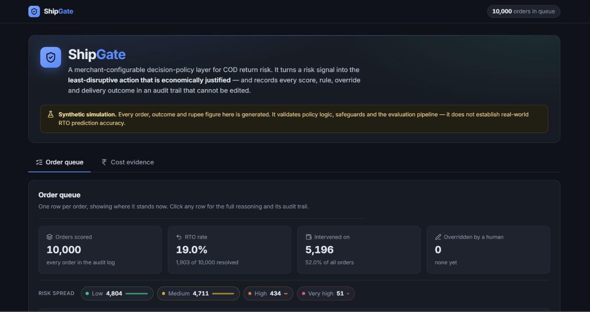

*Dashboard overview — hero banner, the synthetic-data disclaimer that sits on
every view, summary stat cards, and the risk spread across all four tiers.*

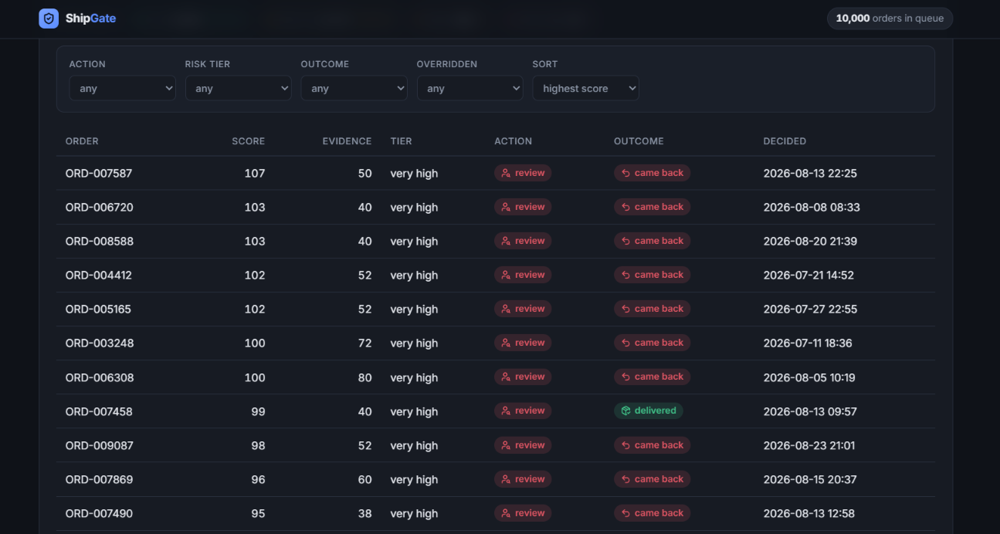

*The order queue: one row per order showing where it stands now, filterable by
action, tier, outcome and override state.*

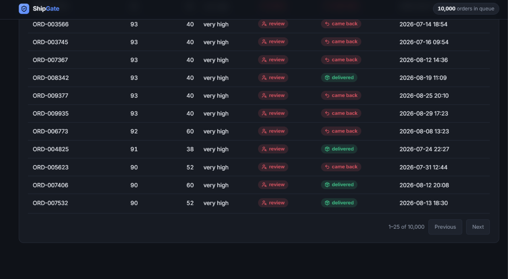

*Pagination across the full 10,000-order set. The total is reported separately
from the page, so the count is honest rather than inferred.*

### Decision detail

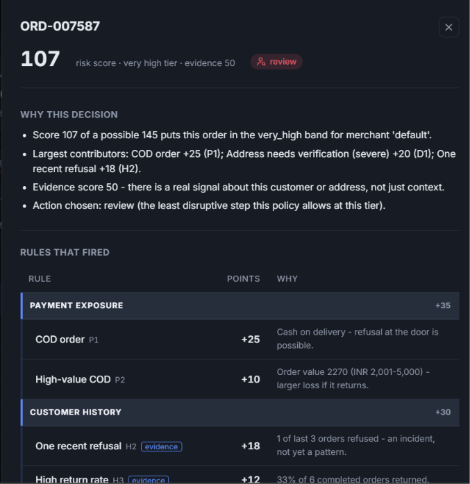

*The decision drawer — every rule that fired, grouped and subtotalled, with the
points each contributed and a plain-language reason for the outcome.*

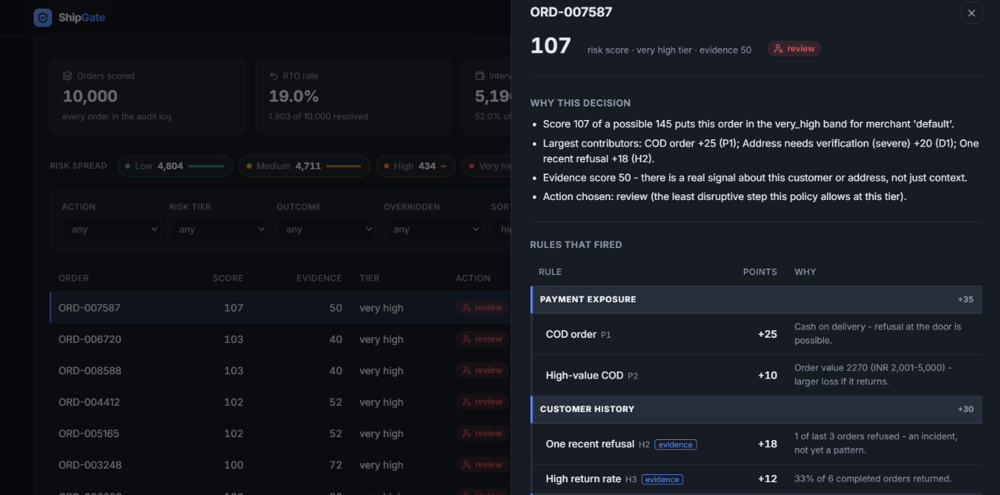

*The drawer opens over the queue, so the decision under inspection stays in the
context of the list it came from.*

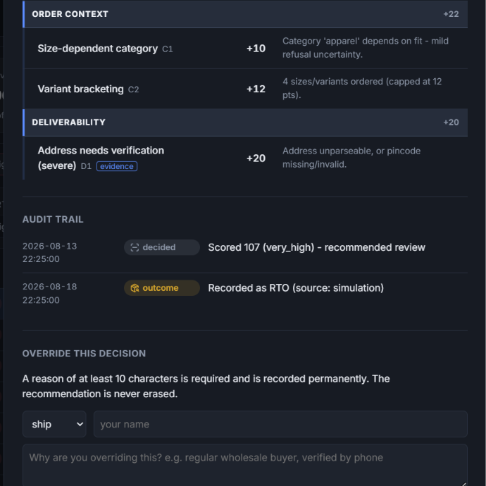

*Order context and deliverability rules, then the append-only audit trail: what
was decided, what a human did about it, and what the parcel actually did.*

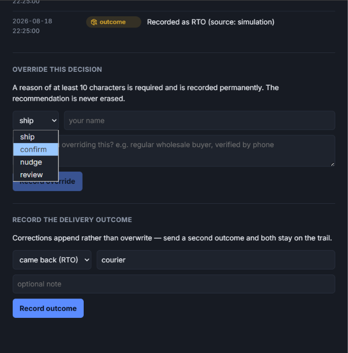

*Overriding a decision requires an action, an actor and a reason of at least ten
characters. The recommendation is never erased — both stay on the record.*

### Cost evidence

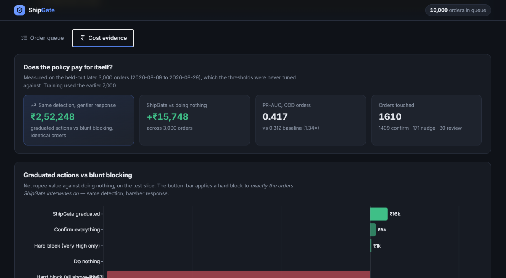

*Net value of each policy against doing nothing. ShipGate's graduated tiers sit
on one side of the zero line and blunt blocking on the other.*

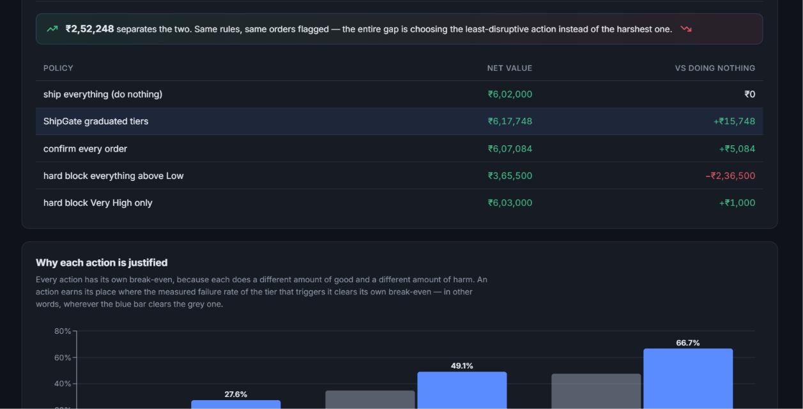

*The same comparison as figures, with the gap between graduated handling and
blocking the identical orders called out directly.*

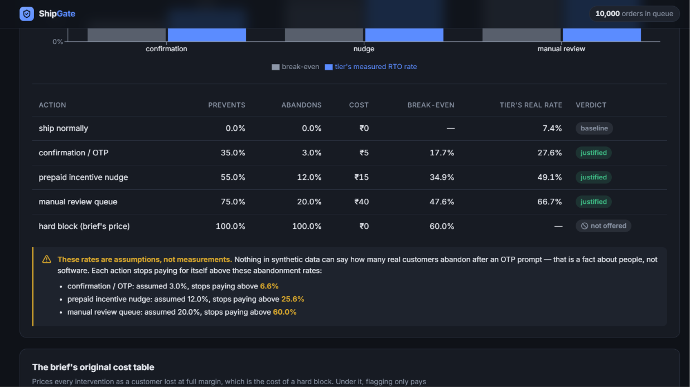

*Each action's break-even against the measured failure rate of the tier that
triggers it — an action is justified where the blue bar clears the grey one. The
assumption this rests on, and the point at which it stops holding, is stated
immediately underneath rather than in a footnote.*

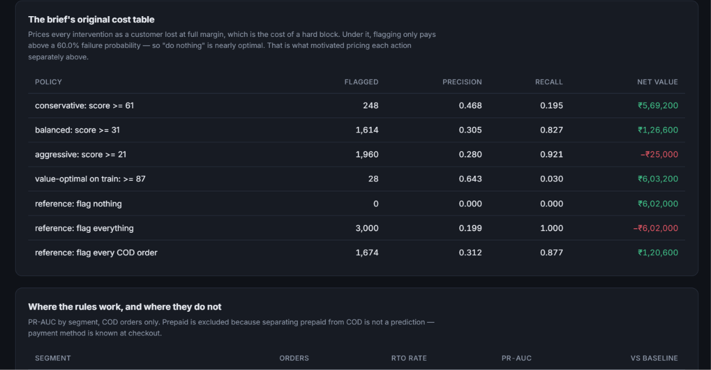

*The original single-cost table, kept unchanged. Under it, intervening only pays
above a 60% failure probability — which is what motivated pricing each action
separately.*

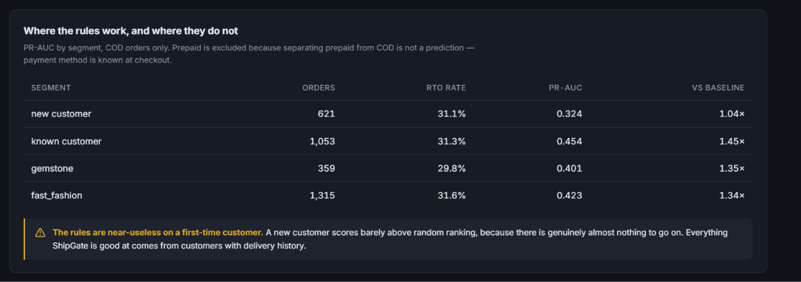

*Ranking quality by segment, with the limitation stated on the page itself: the
rules are close to useless on a first-time customer, and everything they are
good at comes from customers with delivery history.*

---

## Evaluation

### How the data is built, and why it is not circular

Two generators, kept independent by construction:

- `synthetic_generator.py` invents 10,000 orders of **visible checkout data only** — payment method, value, category, variant count, address quality, pincode, timestamp — across 5,067 customers and 300 pincodes over 90 days. It contains no failure logic whatsoever.
- `latent_outcome.py` decides, separately, which orders actually came back. Different coefficients, a different functional form (two competing failure mechanisms rather than an additive score), its own random seed, and hidden factors the rules can never see: a per-customer reliability trait, true pincode difficulty, courier strain, weather disruption, and refusal momentum.

The two modules **share no Python interface at all** — only CSV column names. `latent_outcome.py` imports neither the rule engine nor the generator, and a test asserts this from the syntax tree. If the same logic invented the data and graded it, every metric below would be worthless.

Calibrated against published Indian COD figures: **COD RTO 30.4%**, prepaid 4.8%.

### Chronological split, never random

Orders are sorted by timestamp. The earlier 70% (7,000 orders, Jun 01 – Aug 09) is used for threshold selection. **Every metric reported below comes from the later 30% only** (3,000 orders, Aug 09 – Aug 29), which no threshold was tuned against.

Customer history and pincode statistics are computed by replaying orders forward in time, and only from orders that had **already resolved** before the current order's timestamp. A parcel in transit is not yet a known outcome: with a 5-day delivery lag and frequent buyers ordering every ~5.6 days, that overlap is routine rather than rare.

### Results

| Metric | Value | Baseline | Lift |
|---|---|---|---|
| **PR-AUC, COD orders** | **0.417** | 0.312 | 1.34× |
| PR-AUC, all orders | 0.392 | 0.199 | 1.97× |

The COD-only figure is the one worth quoting. Including prepaid lets a ranking metric take credit for separating prepaid from COD, which is not a prediction — payment method is known at checkout. Note that the less honest number has the *higher* lift.

| Operating point | Precision | Recall |
|---|---|---|
| Confirm and above | 0.321 | 0.920 |
| Prepaid nudge and above | 0.465 | 0.218 |
| Manual review only | 0.667 | 0.038 |

| Segment | Orders | RTO rate | PR-AUC | vs baseline |
|---|---|---|---|---|
| New customer | 621 | 31.1% | 0.324 | **1.04×** |
| Known customer | 1,053 | 31.3% | 0.454 | 1.45× |
| Gemstone cohort | 359 | 29.8% | 0.401 | 1.35× |
| Fast-fashion cohort | 1,315 | 31.6% | 0.423 | 1.34× |

**The rules are close to useless on a first-time customer** — 1.04× is barely better than random ranking. Everything ShipGate is good at comes from customers with delivery history, and that is stated here rather than averaged away.

The two merchant cohorts differ far less than their headline rates suggest. Within COD only, they are 30.8% and 30.2% — statistically indistinguishable. The headline gap comes from **payment mix and basket size**, not from different customer behaviour.

*Synthetic simulation result — validates policy logic, not production accuracy.*

### The cost evidence

The brief's cost table — TP +₹200, FP −₹300, FN −₹200, TN +₹300 — produces an uncomfortable result: **flagging only pays above a 60% failure probability**, so "do nothing" is nearly optimal and the best policy the rules can find beats shipping blind by ₹1,200 across 3,000 orders.

That is not a flaw in the rules. It is what happens when every intervention is priced as a customer lost entirely at full margin — which is the cost of a **hard block**. Setting prevent and abandon rates to 1.0 in the graduated model below reproduces the brief's ±200/±300 swings *exactly*; the equivalence is asserted by a test, not claimed. The brief's table was never a general cost table. It was the price of slamming the door, charged for everything.

Priced per action, each gets its own break-even, and each tier clears the one belonging to its action:

| Action | Prevents | Abandons | Op cost | Break-even | Tier's measured RTO |
|---|---|---|---|---|---|
| Confirmation / OTP | 35% | 3% | ₹5 | 17.7% | **27.6%** ✓ |
| Prepaid nudge | 55% | 12% | ₹15 | 34.9% | **49.1%** ✓ |
| Manual review | 75% | 20% | ₹40 | 47.6% | **66.7%** ✓ |
| Hard block | 100% | 100% | ₹0 | 60.0% | — |

| Policy | Net value | vs doing nothing |
|---|---|---|
| Ship everything (do nothing) | ₹602,000 | — |
| **ShipGate graduated tiers** | **₹617,748** | **+₹15,748** |
| Confirm every order | ₹607,084 | +₹5,084 |
| Hard block Very High only | ₹603,000 | +₹1,000 |
| Hard block everything above Low | ₹365,500 | **−₹236,500** |

Operational load: 1,390 ship · 1,409 confirm · 171 nudge · 30 review.

**The last row is the point.** Applying a blunt block to *exactly the same orders* ShipGate intervenes on destroys ₹236,500 while the graduated policy gains ₹15,748. Same detection, same tiers, same scores — the entire ₹252,248 difference is choosing the least-disruptive action instead of the harshest one.

*Synthetic simulation result — validates policy logic, not production accuracy.*

#### The assumption this rests on, stated plainly

The prevent and abandon rates above are **assumptions about human behaviour that no amount of synthetic data can supply**. Nothing in this project measures how many real customers abandon a checkout after an OTP prompt. Each action stops paying for itself above these abandonment rates:

| Action | Assumed | Stops paying above |
|---|---|---|
| Confirmation / OTP | 3% | **6.6%** |
| Prepaid nudge | 12% | 25.6% |
| Manual review | 20% | 60.0% |

**The confirmation row is the weak link.** 6.6% abandonment on an extra checkout step is entirely plausible in reality, and confirmation carries 1,409 of the 1,610 interventions — so most of the ₹15,748 rests on that one assumption. A real deployment would measure the rate rather than assume it. Do not read ₹15,748 as a projection of real savings.

### A finding worth reporting

Marginally, RTO rises with the number of size variants ordered — 18.5% at one variant, 28.1% at four. That looks like a real signal.

It is not. Holding payment method and category fixed, the gradient flattens to noise. The marginal association is composition: four-variant orders are 100% fit-uncertain category and 73% COD, against 43% and 54% for single-variant orders.

This is direct evidence for a decision already baked into the rule engine — C2 is capped at 12 points and never counted as evidence. A less careful model would happily learn "bracketing → risk" and start penalising customers for a behaviour that carries no independent signal.

---

## Limitations

All evaluation data in this prototype is synthetic. The reported metrics demonstrate the behavior of the rules, policy safeguards, and evaluation pipeline under controlled simulated conditions; they do not establish real-world RTO prediction performance. Production deployment would require merchant-consented historical outcomes, time-forward validation, privacy controls, monitoring, and periodic calibration.

Beyond that, specifically:

- **There is no authentication.** Anyone who can reach the port can override a decision as any actor they name. The `actor` field is self-reported and entirely untrusted. An audit trail whose "who did this" field is unauthenticated is weaker than it looks.
- **The intervention effectiveness rates are assumptions**, as set out above, and the confirmation result is sensitive to one of them.
- **H4 (+5 for new customers) is not supported by this data.** New customers fail *slightly less* than returning ones here (29.4% vs 31.3% on COD), because the returning population contains the repeat refusers. H4 is small and non-evidence, and is kept as an expression of uncertainty rather than measured risk.
- **H5's top discount band (−30, requiring 21+ clean deliveries) never fires.** A 90-day window caps the busiest customer at 15 orders. The band is untestable in this dataset.
- **The simulation is not the world.** A rule engine that scored near-perfectly against this data would indicate a leak, not a good model — a large share of failure variance is invisible to the rules by construction.

### Deliberately not built

Refundable deposits are a plausible future option for the very-high tier and are described here only as an idea; no such code exists. Also absent by choice: real WhatsApp or SMS sending, real payment and refund rails, device fingerprinting, and cross-merchant identity graphs.

---

## Privacy Note

ShipGate stores no customer names, phone numbers, or addresses — not in the audit log, and not anywhere else. A record holds the order id, the merchant id, which rules fired and by how much, the decision taken, and the eventual outcome. An address appears only as its quality band (`complete`, `minor_gap`, `major_gap`, `severe`), which is the only part any rule ever used.

This follows from purpose limitation: the log exists to answer *"why was this order treated this way"*, and answering that does not require a second copy of the customer database. Consistently, `/risk/assess` takes customer-history counts as **inputs** rather than looking them up — those facts belong to the merchant's own order system, and ShipGate is a decision layer over signals it is handed.

A production deployment would use merchant-scoped pseudonymous customer keys so that history cannot be joined across merchants. **A human override is always available, always requires a written reason, and never erases the recommendation it overruled** — both stay on the record permanently.

The audit log is append-only, and this is enforced by the database rather than by convention: six SQLite triggers abort any `UPDATE` or `DELETE`. Opening the file directly and trying to edit a decision raises an error. Corrections are appended; nothing is ever quietly rewritten.

---

## Setup

Requires Python 3.11+. Node is **not** required — the built dashboard is committed.

```bash
python -m venv venv
venv/Scripts/activate            # macOS/Linux: source venv/bin/activate
pip install -r requirements.txt

python -m app.bootstrap --serve
```

That last command generates the synthetic data, decides the outcomes independently, scores every order into the audit log, runs the evaluation, and starts the server — about two seconds, then:

- dashboard → <http://127.0.0.1:8000/>
- API docs → <http://127.0.0.1:8000/docs>

Run `python -m app.bootstrap` without `--serve` to build the data only, and add `--force` to regenerate the CSVs from scratch. Everything is seeded, so a rebuild is byte-identical.

### Tests

```bash
python -m pytest -q          # 193 tests
```

The ones worth reading are the guarantees: `test_does_not_import_sibling_modules` (the outcome simulator cannot see the rule engine), `test_no_order_sees_its_own_outcome` (no leakage in the chronological replay), `test_rows_cannot_be_updated_even_by_raw_sql` (append-only), and `test_pincode_safeguard_survives_the_policy_layer` (configuration cannot switch off a safeguard).

### API

```
POST /risk/assess           score an order, return tier + action + reasons
GET  /orders                the order queue, filtered and paginated
POST /orders/{id}/outcome   record whether it actually became an RTO
POST /orders/{id}/override  merchant override, requires a reason
GET  /orders/{id}/audit     full audit trail for one order
```

### Rebuilding the dashboard

Only needed if you change the frontend. `frontend/dist/` is committed deliberately so the demo runs without a Node toolchain.

```bash
cd frontend && npm install && npm run build
```

---

## Project layout

```
app/
  rule_engine.py        grouped, capped scoring + the shared safeguards
  policy_engine.py      tier -> action, under merchant configuration
  feature_normalizer.py chronological replay; the anti-leakage boundary
  audit_service.py      append-only SQLite log
  synthetic_generator.py visible checkout data only
  latent_outcome.py     independent ground truth
  evaluation.py         chronological split, metrics, both cost models
  main.py               FastAPI: five endpoints + the dashboard
  bootstrap.py          one command to build everything and serve it
frontend/               React dashboard (Vite)
tests/                  193 tests
FINDINGS.md             working log: every bug, number and judgement call
CLAUDE.md               the project brief this was built against
```

`FINDINGS.md` is the honest version of this README — it records what broke, what was measured, and what remains uncertain, including several cases where the first attempt was wrong.
